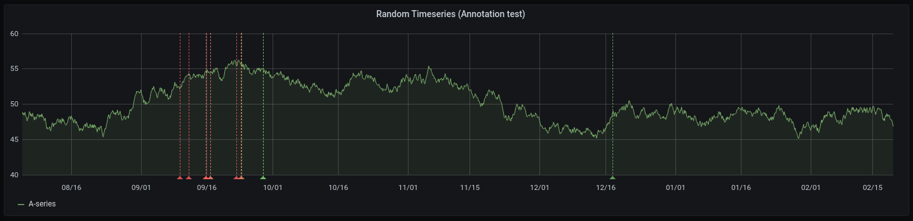
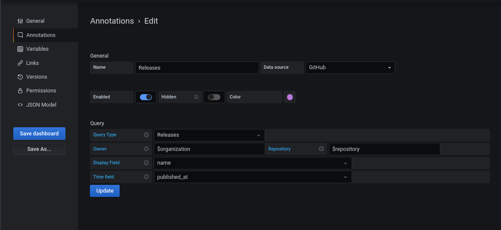

# Grafana GitHub datasource

The GitHub datasource allows GitHub API data to be visually represented in Grafana dashboards.

## Github API V4 (graphql)

This datasource uses the [`githubv4` package](https://github.com/shurcooL/githubv4), which is under active development.

## Features

### Backend
* [x] Releases
* [x] Commits
* [x] Repositories
* [x] Issues
* [x] Organizations
* [x] Labels
* [x] Milestones
* [x] Response Caching
* [ ] Deploys

### Frontend
* [x] Visualize queries
* [x] Template variables
* [x] Annotations

## Caching

Caching on this plugin is always enabled.

## Configuration

Options:

| Setting | Required |
|---------|----------|
| Access token | true |
| Default Organization | false |
| Default Repository | true |

To create a new Access Token, navigate to [Personal Access Tokens](https://github.com/settings/tokens) and create a click "Generate new token."

## Annotations

Annotations overlay events on a graph.

With annotations, you can display:

* Commits
* Issues
* Pull Requests
* Releases
* Tags

on a graph.

All annotations require that you select a field to display on the annotation, and a field that represents the time that the event occured.

## Variables

**Work in progress**

Variables allow you to substitute values in a panel with pre-defined values.

## Access Token Permissions

For all repositories:
* `public_repo`
* `repo:status`
* `repo_deployment`
* `read:packages`

* `user:read`
* `user:email`

An extra setting is required for private repositories
* `repo (Full control of private repositories)`

## Frequently Asked Questions

* I am using GitHub OAuth on Grafana. Can my users make requests with their individual GitHub accounts instead of a shared `access_token`?

No. This requires changes in Grafana first. See [this issue](https://github.com/grafana/grafana/issues/26023) in the Grafana project.

* Why does it sometimes take up to 5 minutes for my new pull request / new issue / new commit to show up?

We have aggressive caching enabled due to GitHub's rate limiting policies. When selecting a time range like "Last hour", a combination of the queries for each panel and the time range is cached temporarily.

* I am trying to use a template variable in the "Query" field and it's not working

Template variables are currently not supported outside of the "Owner / Organization" and "Repository" fields.

* Why are there two selection options for Pull Requests and Issue times when creating annotations?

There are two times that affect an annotation:

* The time range of the dashboard or panel
* The time that should be used to display the event on the graph

The first selection is used to filter the events that display on the graph. For example, if you select "closed at", only events that were "closed" in your dashboard's time range will be displayed on the graph.

The second selection is used to determine where on the graph the event should be displayed.

Typically these will be the same, however there are some cases where you may want them to be different.
