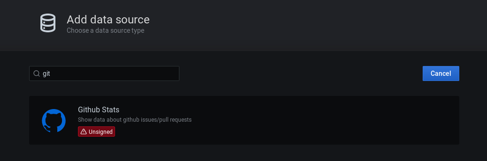

# Developer Guide

This is a very basic guide on how to set up your local environment, make the desired changes and see the result with a fresh Grafana Installation.

## Getting Started

Clone this repository to your local environment. The frontend code lives in the `src` folder, alongside the [plugin.json file](https://grafana.com/docs/grafana/latest/developers/plugins/metadata/). See [this Grafana tutorial](https://grafana.com/docs/grafana/latest/developers/plugins/) to understand better how a plugin is structured and installed.

Backend code, written in Go, is located in the `pkg` folder.

## Requirements

For this standard execution, you will need the following tools:

- [Docker](https://docs.docker.com/get-docker/)
- [Docker Compose](https://docs.docker.com/compose/install/)
- [Yarn](https://classic.yarnpkg.com/en/docs/install)
- [Grafana Toolkit](https://www.npmjs.com/package/@grafana/toolkit)

## Running the development version

### Compiling the Backend

If you have made any changes to any `go` files, you can use [mage](https://github.com/magefile/mage) to recompile the plugin.

```sh
mage build:linux && mage reloadPlugin
```

### Compiling the Frontend

After you made the desired changes, you can build and test the new version of the plugin using `yarn`:

```sh
yarn test # run all test cases
yarn dev # builds and puts the output at ./dist
```

Alternatively, you can have yarn watch for changes and automatically recompile them.

```sh
yarn watch
```

Now that you have a `./dist` folder, you are ready to run a fresh Grafana instance and put the new version of the datasource into [Grafana plugin folder](https://grafana.com/docs/grafana/latest/plugins/installation/).

### Development resources

We provide development resources to make it easier to contribute to and develop the GitHub data source.

### Docker Compose

[Docker Compose file](/docker-compose.yml) is available to help you to get started. When you call up `docker compose up` inside the project folder, it will:

1. Run a new instance of Grafana from the master branch and map it into port `3000`.
1. Configure the instance to allow an unsigned version of `github-datasource` to be installed.
1. Map the current folder contents into `/var/lib/grafana/plugins`.

This is enough for you to see the GitHub Datasource in the datasource list at `http://localhost:3000/datasources/new`.



If you make further changes into the code, be sure to run `yarn dev` again and restart the Grafana instance.

### Dev dashboards

You can find example dashboard that uses GitHub data source in [dashboards folder](./src/dashboards/).

## Submitting PR

If you are creating a PR, ensure to run `yarn changeset` from your branch. Provide the details accordingly. It will create `*.md` file inside `./.changeset` folder. Later during the release, based on these changesets, package version will be bumped and changelog will be generated.

## Releasing & Bumping version

To create a new release, execute `yarn changeset version`. This will update the Changelog and bump the version in `package.json` file. Commit those changes. Run the `Plugins - CD` GitHub Action to publish the new release.

## Development resources
